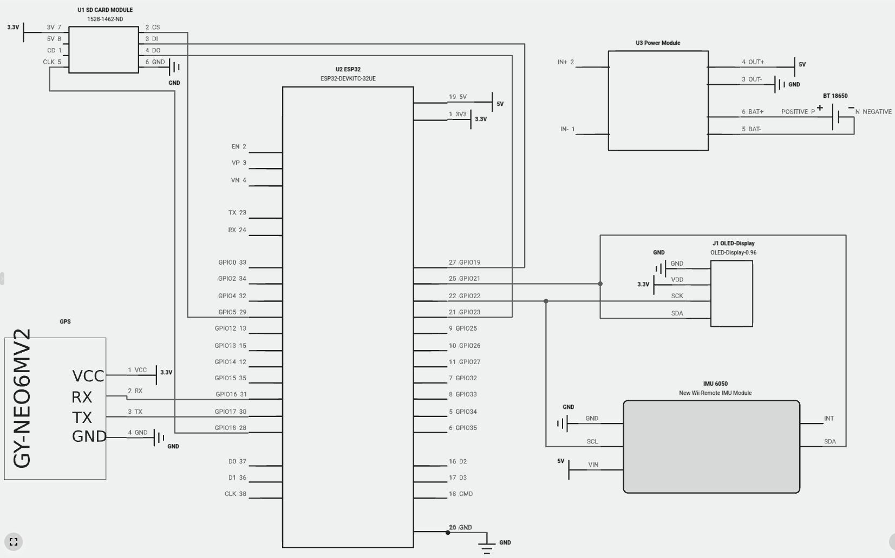
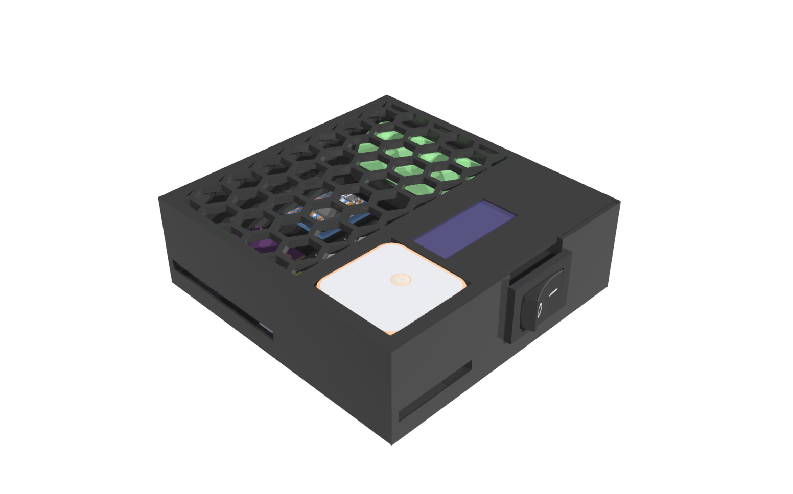
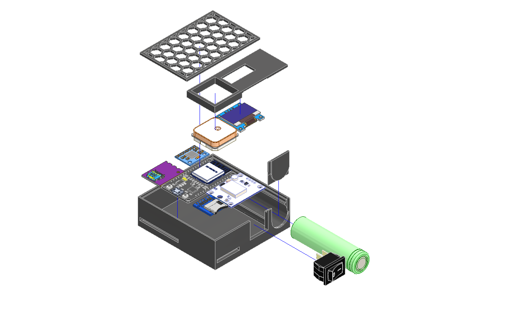
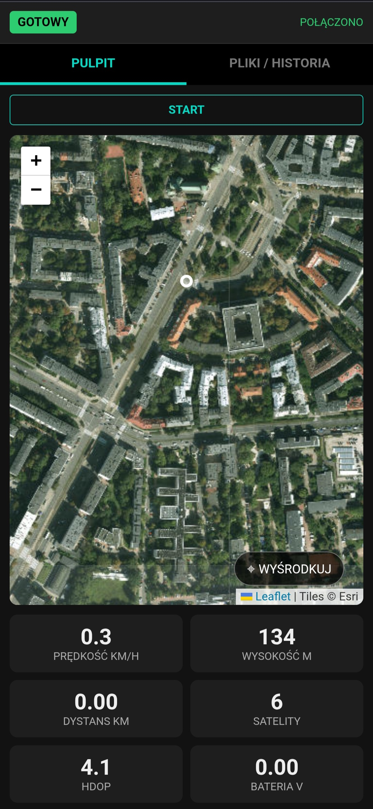
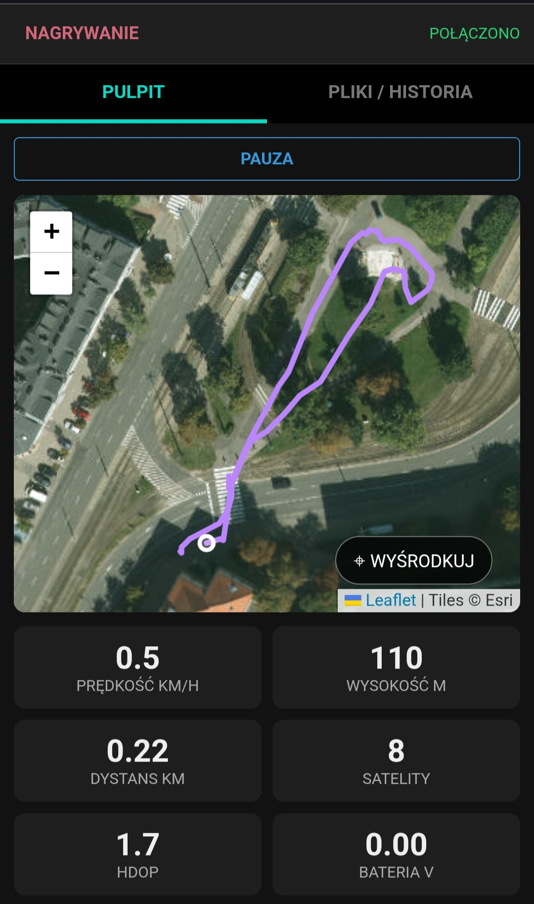
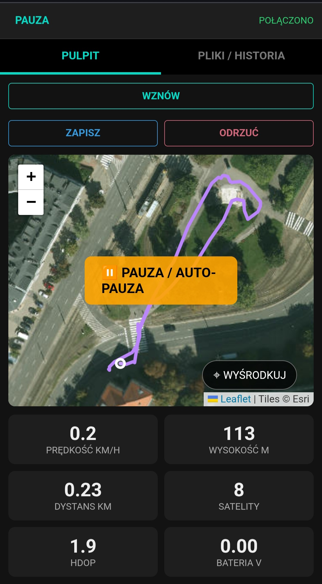
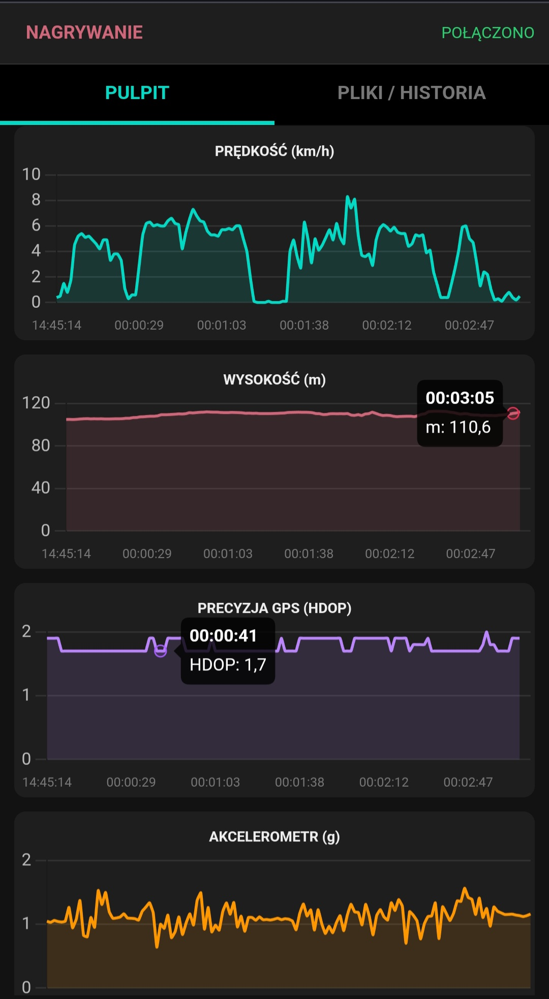
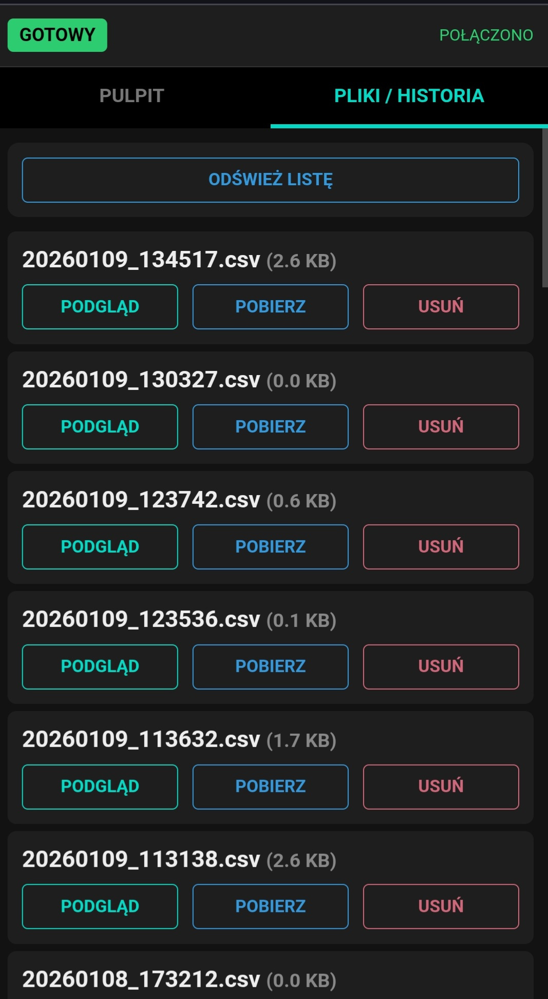
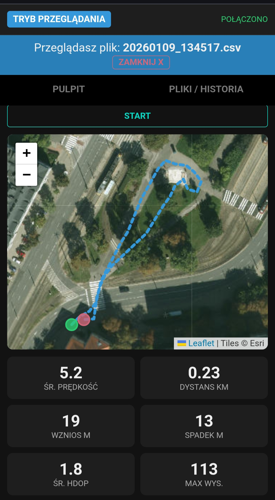
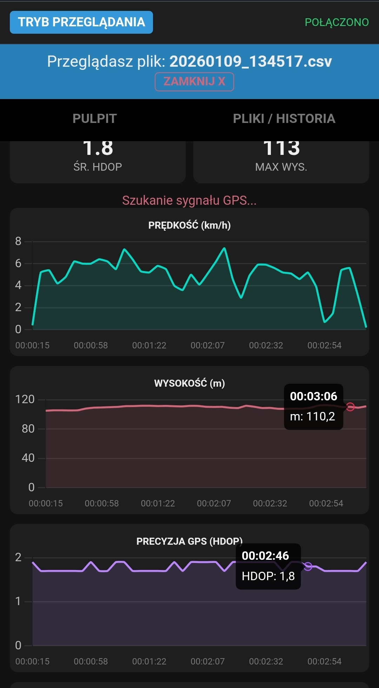

# Projekt i realizacja autonomicznego rejestratora parametrów ruchu GPS z interfejsem bezprzewodowym opartym o układ ESP32

## Wstęp

  Celem tej pracy jest zaprojektowanie i zbudowanie urządzenia typu “GPS Tracker". Urządzenie ma rejestrować trasę, monitorować parametry ruchu i pokazywać dane w czasie rzeczywistym.

Głównym założeniem projektu było stworzenie systemu autonomicznego, zasilanego bateryjnie, który łączy w sobie funkcjonalność klasycznego rejestratora danych (tzw. "czarnej skrzynki") z nowoczesnym interfejsem użytkownika dostępnym przez przeglądarkę internetową (Web Interface).

### Koncepcja architektury systemu telemetrycznego

Największy problem przy tworzeniu przenośnych rejestratorów danych to znalezienie balansu między siłą obliczeń a zużyciem prądu. Stare, proste rejestratory danych tylko zapisują dane i nic więcej nie robią. Natomiast nowe rozwiązania IoT chcą przetwarzać dane tam, gdzie je zbierają, i nie potrzebują zewnętrznych serwerów. Z mojego doświadczenia widzę, że ten balans decyduje o tym, czy rejestrator będzie działał długo i dobrze.

W niniejszym projekcie przyjęto założenie, że urządzenie nie tylko gromadzi surowe dane pomiarowe, ale działa jako  niezależny serwera aplikacj i udostępnia pełny graficzny interfejs. To wymusiło rezygnację z prostych mikrokontrolerów 8-bitowych na rzecz wydajniejszych jednostek obliczeniowych, łączących wiele funkcji (w tym bezprzewodową łączność) w jednym układzie scalonym.

Do realizacji zadania wybrano platformę **ESP32**, kierując się jej unikalną architekturą dwurdzeniową. Pozwala ona na separację procesów krytycznych (obsługa przerwań GPS i IMU) od obsługi stosu sieciowego WiFi, co jest ważne, żeby dane były zapisywane ciągle. Dodatkowo, wysoki stopień integracji w jednym układzie pozwolił zminimalizować wymiary urządzenia oraz uprościć układ oraz obniżyć cene.

## Projekt sprzętowy

Warstwa sprzętowa urządzenia została zaprojektowana w sposób modułowy, co ułatwia diagnostykę oraz ewentualną wymianę komponentów. System składa się z następujących komponentów:

### Elementy układu

* **Mikrokontroler:** ESP32 DevKit V1 WROOM-32 – dwurdzeniowy procesor z WiFi i Bluetooth
* **Moduł GPS:** NEO-6M V2 – odbiornik satelitarny (komunikacja UART)
* **IMU (czujnik ruchu):** MPU6050 – akcelerometr i żyroskop 6-osiowy (I2C)
* **Wyświetlacz:** OLED 0.96" – monochromatyczny ekran 128x64 px (I2C)
* **Pamięć masowa:** Micro SD Card Module – czytnik kart MicroSD (SPI)
* **Zasilanie:** Ładowarka Li-Ion z wejściem USB-C i zabezpieczeniami, współpracująca z ogniwem 18650. Układ umożliwia ładowanie baterii lub zasilanie systemu bezpośrednio z portu USB.

### Konfiguracja interfejsów i połączeń

Wszystkie moduły peryferyjne zostały połączone z mikrokontrolerem zgodnie z załączonym schematem elektrycznym. Kluczowym wymogiem poprawności działania układu jest połączenie wszystkich mas (GND) w jeden wspólny potencjał.



**Magistrala I2C (OLED + MPU6050):**
Urządzenia podłączone równolegle do wspólnych linii SDA i SCL.

| Urządzenie | Pin Modułu | Pin ESP32 | Uwagi |
| :--- | :--- | :--- | :--- |
| **OLED 0.96"** | SDA | GPIO 21 | Adres I2C: 0x3C |
| | SCL | GPIO 22 | |
| | VCC | 3.3V | Z pinu 3V3 ESP32 |
| | GND | GND | Wspólna masa |
| **MPU6050 (IMU)** | SDA | GPIO 21 | Adres I2C: 0x68 |
| | SCL | GPIO 22 | |
| | VCC | 5V | Z pinu 5V OUT power module |
| | GND | GND | Wspólna masa |

**Moduł GPS NEO-6M V2 (UART):**
Wykorzystuje sprzętowy port szeregowy UART2.

| Pin Modułu GPS | Pin ESP32 | Funkcja |
| :--- | :--- | :--- |
| TX | GPIO 16 (RX2) | Transmisja z GPS do ESP32 |
| RX | GPIO 17 (TX2) | Konfiguracja GPS (opcjonalna) |
| VCC | 3.3V | Z pinu 3V3 ESP32 |
| GND | GND | Wspólna masa |

**Micro SD Card Module (SPI):**
Wykorzystuje standardową magistralę VSPI.

| Pin Modułu SD | Pin ESP32 | Funkcja |
| :--- | :--- | :--- |
| CS | GPIO 5 | Chip Select |
| SCK | GPIO 18 | Zegar synchronizacji |
| MISO | GPIO 19 | Dane (Master In, Slave Out) |
| MOSI | GPIO 23 | Dane (Master Out, Slave In) |
| VCC | 3.3V | Z pinu 3V3 ESP32 |
| GND | GND | Wspólna masa |

### Projekt obudowy

Obudowa została zaprojektowana w Autodesk Inventor z przeznaczeniem do druku 3D. Składa się z podstawy, ramki montażowej i pokrywy z wzorem plastra miodu. Podstawa zawiera komory na poszczególne moduły oraz schowek na ogniwo 18650. Ramka dystansowa tworzy okno dostępu do ekranu i GPS. Pokrywa z ażurowym wzorem zapewnia podglad wnetrza układu.






## Implementacja oprogramowania

### Opis funkcjonalności i obsługa aplikacji

Aplikacja webowa stanowi główne centrum sterowania urządzeniem. Poniżej przedstawiono szczegółowy opis interfejsu oraz dostępnych funkcji, które zostały zaimplementowane w celu zapewnienia intuicyjnej obsługi.

#### Ekran główny i parametry na żywo

Po nawiązaniu połączenia z siecią Wi-Fi urządzenia, w prawym górnym rogu aplikacji widoczny jest status "POŁĄCZONO". W przypadku utraty zasięgu lub zerwania połączenia, komunikat natychmiast zmienia się na "ROZŁĄCZONO", informując użytkownika o braku aktualnej synchronizacji danych.

Ekran główny został podzielony na dwie sekcje logiczne: mapę z aktualną pozycją (wykorzystującą bibliotekę Leaflet) oraz panel parametrów telemetrycznych.

Na panelu dolnym wyświetlane są kluczowe parametry odświeżane w czasie rzeczywistym:

* **Prędkość:** Aktualna prędkość przemieszczania się wyrażona w km/h.
* **Wysokość:** Wysokość nad poziomem morza w metrach.
* **Dystans:** Całkowita długość trasy przebyta w bieżącej sesji.
* **Satelity:** Liczba widocznych i używanych do nawigacji satelitów, co pozwala ocenić jakość "fixa".
* **HDOP:** Parametr precyzji geometrycznej (im niższy, tym lepiej).
* **Bateria:** Napięcie ogniwa zasilającego, pozwalające monitorować stan naładowania.

W sytuacji, gdy urządzenie nie posiada jeszcze ustalonej pozycji GPS (np. zaraz po włączeniu wewnątrz budynku), na ekranie widnieje wyraźny komunikat o szukaniu sygnału GPS.



**Proces nagrywania trasy**

Sterowanie procesem rejestracji odbywa się za pomocą centralnego przycisku **"START"**. Rozpoczęcie nagrywania aktywuje rysowanie śladu na mapie oraz zliczanie statystyk sesji. Aplikacja udostępnia również funkcję centrowania mapy – specjalny przycisk pozwala jednym kliknięciem przywrócić widok na aktualną pozycję GPS, co jest przydatne po ręcznym przesuwaniu mapy w celu podejrzenia okolicy.

System obsługuje zaawansowane funkcje pauzowania:

* **Pauza manualna:** Użytkownik może w każdej chwili ręcznie wstrzymać zapis przyciskiem "PAUZA".
* **Auto-Pauza:** System automatycznie wykrywa brak ruchu i wstrzymuje zapis, co jest sygnalizowane pomarańczowym komunikatem "PAUZA / AUTO-PAUZA" na mapie. Zapobiega to rejestrowaniu błędnych punktów podczas postojów.

Po zakończeniu aktywności użytkownik ma do wyboru trzy opcje:

1. **WZNÓW:** Powrót do nagrywania w ramach tej samej sesji.
2. **ZAPISZ:** Trwałe zapisanie zgromadzonych danych do pliku w pamięci urządzenia.
3. **ODRZUĆ:** Anulowanie sesji i usunięcie tymczasowych danych bez zapisu.




**Wykresy i analiza trendów**

Dla bardziej wnikliwej analizy aktywności, aplikacja udostępnia sekcję wykresów rysowanych na żywo. Pozwala to na bieżąco śledzić historię parametrów:

* Profil prędkości w czasie.
* Profil wysokości n.p.m.
* Wykres precyzji GPS (HDOP).
* Odczyty z akcelerometru (siły przeciążeń).



#### Zarządzanie plikami i historia tras

Druga zakładka interfejsu, "PLIKI / HISTORIA", dedykowana jest zarządzaniu danymi zgromadzonymi na karcie SD. Użytkownik otrzymuje pełną kontrolę nad archiwum tras bez konieczności wyjmowania karty z urządzenia.

Dostępne funkcjonalności obejmują:

* **Odświeżanie listy:** Pobranie aktualnego wykazu plików z karty SD.
* **Pobieranie:** Transfer wybranego pliku .csv/.txt bezpośrednio do pamięci telefonu/komputera.
* **Usuwanie:** Trwałe usunięcie niepotrzebnych plików.
* **Podgląd:** Specjalny tryb wizualizacji archiwalnej sesji.



W trybie **podglądu pliku** interfejs prezentuje kompletny ślad trasy na mapie oraz rozszerzony zestaw statystyk, niedostępnych w trybie na żywo, takich jak:

* **Średnia prędkość:** Wartość wyliczona dla całej trasy, z uwzględnieniem postojów (auto-pauza).
* **Suma wzniosów i spadków:** Łączna różnica wysokości pokonana podczas sesji.
* **Maksymalna wysokość:** Najwyższy punkt osiagnięty na trasie (max AMSL).
* **Dystans:** Całkowita długość trasy.
* **Średnie HDOP:** Średnia wartość precyzji pomiaru z całego zapisu, pozwalająca ocenić wiarygodność danych.



Dodatkowo, w trybie podglądu użytkownik ma dostęp do szczegółowych wykresów analizujących przebieg całej trasy. Są to te same wykresy co w trybie na żywo (prędkość, wysokość, HDOP), ale przedstawiające kompletne dane z całego nagrania, co pozwala na łatwą identyfikację kluczowych momentów wycieczki.



Dane zapisywane są na karcie SD w formacie CSV (Comma Separated Values), co umożliwia ich łatwy import do arkuszy kalkulacyjnych (np. Excel) lub specjalistycznego oprogramowania GIS. Każda linia w pliku odpowiada jednemu punktowi pomiarowemu i zawiera następujące pola, oddzielone przecinkami:

* **Czas (ms):** Czas systemowy w milisekundach od uruchomienia urządzenia.
* **Szerokość i Długość geograficzna:** Współrzędne GPS (format dziesiętny).
* **Prędkość (km/h):** Chwilowa prędkość ruchu.
* **Wysokość (m n.p.m.):}** Wysokość nad poziomem morza.
* **HDOP:** Precyzja pomiaru poziomego (im mniejsza wartość, tym lepiej).
* **Satelity:** Liczba widocznych satelitów użytych do ustalenia pozycji.
* **Akcelerometr (ax, ay, az):** Surowe dane z czujnika przeciążeń dla trzech osi.
* **Bateria (V):** Napięcie zasilania w momencie pomiaru.

Przykładowa struktura linii danych:

```
millis,lat,lon,speed,alt,hdop,sats,ax,ay,az,batt
34500,52.2297,21.0122,15.5,112.4,1.2,8,0.02,-0.98,0.15,4.12
```

**Integracja z wyświetlaczem OLED**

Niezależnie od aplikacji mobilnej, urządzenie wyposażone jest w fizyczny ekran OLED. Pełni on funkcję pomocniczą, prezentując najważniejsze informacje w zwięzłej formie:

* Aktualny status: Oczekiwanie / Nagrywanie / Pauza.
* Liczba widocznych satelitów (ikona "SAT").
* Bieżąca prędkość oraz przebyty dystans.
* Adres IP oraz nazwa sieci WiFi (SSID) w celu ułatwienia połączenia.

## Wnioski końcowe

Przeprowadzone testy i analiza działania prototypu pozwalają na sformułowanie następujących wniosków:

1. **Stabilność działania:** Dzięki wykorzystaniu dwóch rdzeni procesora ESP32, urządzenie działa płynnie. Nagrywanie trasy na kartę odbywa się niezależnie od obsługi WiFi, więc korzystanie z podglądu na telefonie nie zakłóca zapisu danych.
2. **Prosty i szybki interfejs:** Strona WWW została napisana tak, aby nie obciążać procesora. Telefon pobiera tylko surowe liczby, a nie całą grafikę, dzięki czemu aplikacja działa szybko i nie zacina się.
3. **Jakość modułu GPS:** Tani moduł NEO-6M jest wystarczający do turystyki pieszej i zastosowań amatorskich. W testach statycznych wykazuje wysoką precyzję, jednak w dynamicznym ruchu (bieg) i trudnym terenie (las) jego dokładność spada, co jest typowe dla odbiorników bez wspomagania inercyjnego.
4. **Efektywność energetyczna:** Osiągnięty czas pracy na poziomie ok. 9 godzin przy zasilaniu z jednego ogniwa 18650 (z przetwornicą) czyni urządzenie praktycznym w jednodniowych zastosowaniach.
5. **Obudowa 3D:** Zaprojektowana obudowa jest kompaktowa i funkcjonalna. Chroni elektronikę przed uszkodzeniami mechanicznymi, zapewniając jednocześnie łatwy dostęp do portu ładowania i karty pamięci.

### Podsumowanie działania

Zrealizowany system działa w pełni poprawnie i spełnił wszystkie założenia oraz cel pracy. Urządzenie pomyślnie przeszło testy terenowe, rejestrując trasy bez awarii. Projekt udowodnił, że wykorzystując tanie i ogólnodostępne moduły (ESP32, NEO-6M), można zbudować narzędzie telemetryczne o funkcjonalności zbliżonej do prostych urządzeń komercyjnych.

Dodatkową wartością projektu jest jego aspekt edukacyjny. Budowa urządzenia wymagała połączenia wiedzy z zakresu elektroniki, druku 3D oraz programowania systemów wbudowanych i aplikacji webowych. Powstały prototyp jest nie tylko działającym urządzeniem, ale także solidną platformą do dalszego rozwoju, np. poprzez dodanie modułu GSM w przyszłości.
